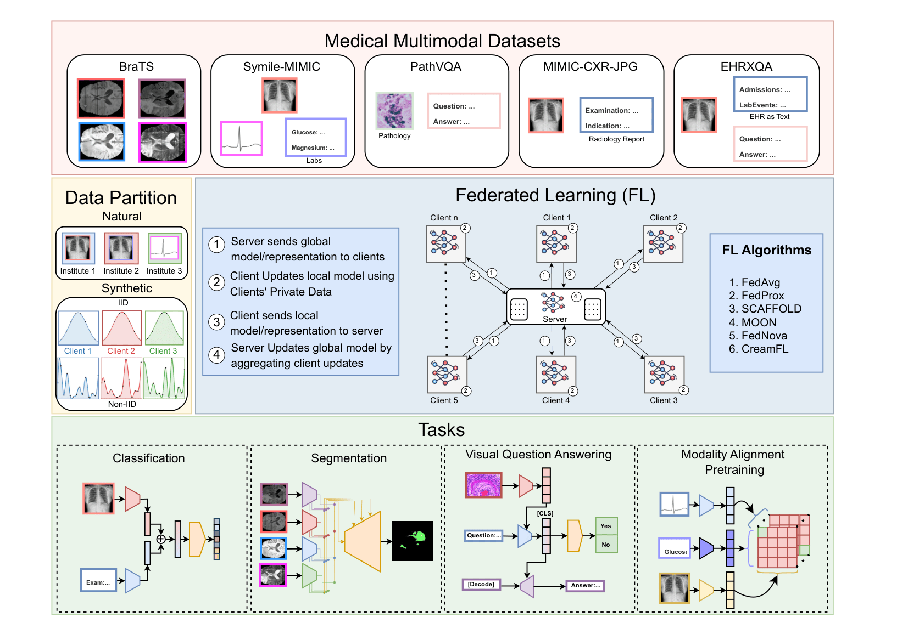

# Med-MMFL: A Multimodal Federated Learning Benchmark in Healthcare
This codebase provides a Pytorch implementation of:

> **Med-MMFL: A Multimodal Federated Learning Benchmark in Healthcare.**  
[](https://github.com/bhattarailab/fmlbenchmark)  
Aavash Chhetri*, Bibek Niroula*, Pratik Shrestha, Yash Raj Shrestha, Lesley A. Anderson,  
Prashnna K. Gyawali, Loris Bazzani, Binod Bhattarai†  
\* Equal contribution  
† Corresponding author  


---

## Abstract

Federated learning (FL) enables collaborative model training across decentralized medical institutions while preserving data privacy. However, medical FL benchmarks remain scarce, with existing efforts focusing mainly on unimodal or bimodal modalities and a limited range of medical tasks. This gap underscores the need for standardized evaluation to advance systematic understanding in medical MultiModal FL (MMFL). To this end, we introduce Med-MMFL, the first comprehensive MMFL benchmark for the medical domain, encompassing diverse modalities, tasks, and federation  scenarios. Our benchmark evaluates six representative state-of-the-art FL algorithms, covering different aggregation strategies, loss formulations, and regularization techniques. It spans datasets with 2 to 4 modalities, comprising a total of 10 unique medical modalities, including text, pathology images, ECG, X-ray, radiology reports, and multiple MRI sequences. Experiments are conducted across naturally federated, synthetic IID, and synthetic non-IID settings to simulate real-world heterogeneity. We assess segmentation, classification, modality alignment (retrieval), and VQA tasks. To support reproducibility and fair comparison of future multimodal federated learning (MMFL) methods under realistic medical settings, we release the complete benchmark implementation, including data processing and partitioning pipelines, at [bhattarailab/Med-MMFL-Benchmark](https://github.com/bhattarailab/Med-MMFL-Benchmark).

---



---

## 🚀 Key Features

| Feature | Description |
|--------|-------------|
| 🔄 **6 FL Algorithms** | FedAvg, FedProx, SCAFFOLD, FedNova, MOON, CreamFL |
| 🏥 **5 Medical Datasets** | BraTS24, MIMIC-CXR, SYMILE-MIMIC, EHRXQA, PathVQA |
| 🧩 **Plug-and-Play Design** | Add new algorithms without modifying core code |
| 📊 **WandB Integration** | Real-time experiment tracking and visualization |
| 🔧 **Reproducible Experiments** | SLURM scripts, configs, and complete documentation |

---

## 📚 Supported Algorithms

| Algorithm | Paper | Key Contribution |
|----------|------|-----------------|
| **FedAvg** | [Link](https://arxiv.org/abs/1602.05629) | Communication-efficient averaging |
| **FedProx** | [Link](https://arxiv.org/abs/1812.06127) | Handles system heterogeneity | 
| **SCAFFOLD** | [Link](https://arxiv.org/abs/1910.06378) | Variance reduction via control variates | 
| **FedNova** | [Link](https://arxiv.org/abs/2007.07481) | Non-IID optimization |
| **MOON** | [Link](https://arxiv.org/abs/2103.16257) | Model contrastive learning |
| **CreamFL** | [Link](https://arxiv.org/abs/2302.08888) | Cross-modal distillation |

**Add Your Own:** See [HOW_TO_EXTEND.md](HOW_TO_EXTEND.md) for adding new algorithms.

---

## 📦 Installation & CLI Entrypoint

The benchmark is structured as a standard Python package. You can install it and its dependencies using:

### Using Conda
```bash
# Create and activate conda environment
conda env create -f benchmark-env.yml
conda activate benchmark-env

# Install package in development mode
pip install -e .
```

Once installed, the project exposes the CLI command `med-mmfl-bench` as a drop-in replacement for running `python main.py`.

---

## 🏥 Supported Datasets

### 1. BraTS24: Brain Tumor Segmentation (3D)

**Task:** Multi-class 3D brain tumor segmentation
- **Modalities:** MRI (T1, T1c, T2, FLAIR)
- **Classes:** 4 classes (0: Background, 1: Necrotic Tumor Core, 2: Peritumoral Edematous Tissue, 3: GD-enhancing Tumor). Evaluated on 3 composite regions: Whole Tumor (WT), Tumor Core (TC), and Enhancing Tumor (ET).
- **Models:** `rfnet`
- **Metrics:** Dice score, Jaccard/IoU
- **Access:** [BraTS Challenge](https://www.synapse.org/Synapse:syn53708249)
  - Training + Additional -> [syn59059776](https://www.synapse.org/Synapse:syn59059776)

### 2. MIMIC-CXR: Chest X-Ray Classification

**Task:** Multi-label chest disease classification  
- **Modalities:** Chest X-ray images + radiology reports (image-text)
- **Classes:** 14 pathologies (Pneumonia, Edema, Atelectasis, etc.)
- **Models:** `mimic_mmclf` (multimodal classifier), `mimic_image_classifier`, `mimic_text_classifier`
- **Metrics:** Accuracy, F1-score, AUC-ROC
- **Access:** [PhysioNet MIMIC-CXR](https://physionet.org/content/mimic-cxr-jpg/) (requires registration)


### 3. SYMILE-MIMIC: Multimodal Medical Data

**Task:** Multimodal contrastive learning
- **Modalities:** Chest X-ray (images) + ECG (signals) + Laboratory tests
- **Models:** `symile_mimic`
- **Metrics:** Contrastive loss, downstream task accuracy
- **Access:** [Symile-MIMIC](https://physionet.org/content/symile-mimic/1.0.0/)


### 4. EHRXQA: EHR + Image Question Answering

**Task:** Generative visual question answering
- **Modalities:** Medical images + Electronic health records (structured + text)
- **Models:** `blip_ehrxqa`
- **Access:** [EHRXQA Dataset](https://physionet.org/content/ehrxqa/1.0.0/)


### 5. PathVQA: Pathology Image Question Answering

**Task:** Binary/categorical visual question answering
- **Modalities:** Pathology images + questions (text)
- **Classes:** Yes/No answers
- **Models:** `blip_yesno_vqa`
- **Access:** [PathVQA](https://arxiv.org/abs/2003.10286)


---

## 🔧 Plug-and-Play Architecture

Med-MMFL's core strength is its **modular design**. Add new algorithms, models, or datasets without modifying framework code.

### Adding a New Algorithm

1. **Implement** the algorithm optimizer in `src/med_mmfl_bench/algorithms/`
2. **Implement dataset-specific servers** in `src/med_mmfl_bench/servers/{dataset}/`
3. **Register** server mapping in the central registries in `src/med_mmfl_bench/cli.py`
4. **Create configuration** in `configs/my_algorithm.yml`
5. **Run experiments:** `python main.py --config configs/my_algorithm.yml --algorithm my_algorithm`

[Complete Guide →](HOW_TO_EXTEND.md)


---

## 📊 Configuration

Experiments are controlled via YAML files. Comprehensive guide: [configs/readme.md](configs/readme.md)

### Example BraTS Configuration

```yaml
dataset:
  img_path: /path/to/brats24/training_data
  ann_path: /path/to/brats24/splits
  dset_name: brats24
  view: federated
  partition: natural                    # See below

model:
  name: rfnet
  in_channels: 4                        # T1, T1c, T2, FLAIR
  n_classes: 4                          

optimizer:
  name: SGD
  learning_rate: 0.0001
  weight_decay: 0.00001
  momentum: 0.9

train:
  local_epoch: 5                        # Epochs per client per round
  grad_clip: 2
  use_fp16: True                        # Mixed precision
```

### Data Partitions

**Important:** Partitions are **generated from raw data** using provided scripts. We do not include pre-built partition files.

**Available partition types:**

| Partition | Description | Use Case |
|-----------|-------------|----------|
| `natural` | Original non-IID distribution | Realistic heterogeneous scenarios |
| `iid-c3` | IID, 3 clients | Controlled baseline |
| `iid-c5` | IID, 5 clients | Controlled baseline |
| `non-iid_02-c3` | Non-IID (Dirichlet α=0.2), 3 clients | High heterogeneity |
| `non-iid_08-c3` | Non-IID (Dirichlet α=0.8), 3 clients | Mild heterogeneity |


---

## 🚀 Quick Start

### 1. Install and Setup

Use [script](./scripts/create-env.sh) to create the environment.

### 2. Prepare Data and config

Create partition files 

Use [config](./configs/readme.md) to set your configuration.

### 3. Run Experiment

You can run experiments using either `python main.py` or the `med-mmfl-bench` CLI:

```bash
# BraTS with FedAvg using main.py
python main.py \
    --config configs/fedavg.yml \
    --algorithm fedavg \
    --comm-rounds 30 \
    --seed 42 \
    --name my_first_experiment \
    --wandb

# Or using the med-mmfl-bench CLI command
med-mmfl-bench \
    --config configs/fedavg.yml \
    --algorithm fedavg \
    --comm-rounds 30 \
    --seed 42 \
    --name my_first_experiment \
    --wandb
```

### 4. Monitor Results

Look at wandb page.

**For detailed tutorials:** [REPRODUCE.md](REPRODUCE.md)

---

## 📖 Documentation

| Document | Purpose |
|----------|---------|
| [REPRODUCE.md](REPRODUCE.md) | Complete reproduction guide with all datasets and experiments |
| [configs/readme.md](configs/readme.md) | Configuration parameters and hyperparameter tuning |
| [scripts/README.md](scripts/README.md) | Guide to SLURM scripts and batch experiments |
| [HOW_TO_EXTEND.md](HOW_TO_EXTEND.md) | Add new algorithms to the framework |


## 📄 Citation

If you use Med-MMFL in your research, please cite the paper:

```bibtex
@misc{chhetri2026medmmflmultimodalfederatedlearning,
  title={Med-MMFL: A Multimodal Federated Learning Benchmark in Healthcare}, 
  author={Aavash Chhetri and Bibek Niroula and Pratik Shrestha and Yash Raj Shrestha and Lesley A Anderson and Prashnna K Gyawali and Loris Bazzani and Binod Bhattarai},
  year={2026},
  eprint={2602.04416},
  archivePrefix={arXiv},
  primaryClass={cs.CV},
  url={https://arxiv.org/abs/2602.04416}, 
}
```

For other formats, see [CITATION.cff](CITATION.cff).

---

## 📄 License

This project is licensed under the Apache License 2.0 — see the [LICENSE](LICENSE) file for details.

---

## 🤝 Contributing

We welcome contributions! Areas for contribution:

- ✨ New federated learning algorithms
- 🏥 Additional medical datasets
- 📈 Performance optimizations
- 📚 Documentation improvements
- 🐛 Bug fixes and testing

Please open an issue or pull request on [GitHub](https://github.com/bhattarailab/Med-MMFL-Benchmark).

---

## 📞 Support

- **Issues:** [GitHub Issues](https://github.com/bhattarailab/Med-MMFL-Benchmark/issues)
- **Discussions:** [GitHub Discussions](https://github.com/bhattarailab/Med-MMFL-Benchmark/discussions)
- **Documentation:** See [REPRODUCE.md](REPRODUCE.md), [configs/readme.md](configs/readme.md), [HOW_TO_EXTEND.md](HOW_TO_EXTEND.md)
